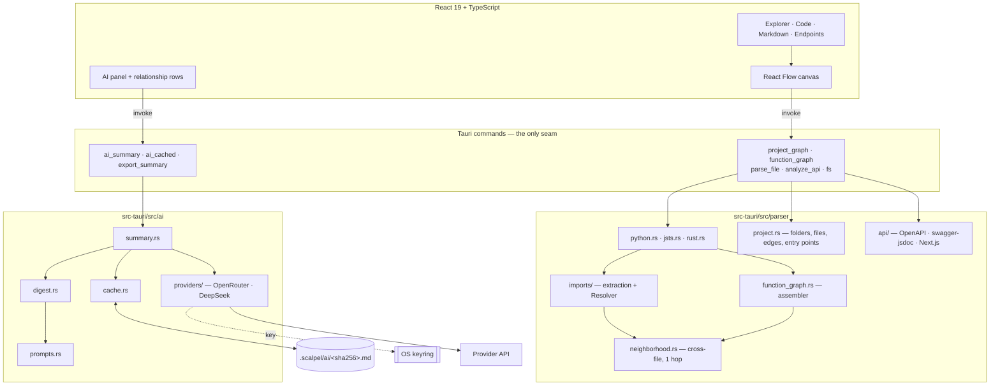

# SyntaxScalpel

[](https://tauri.app)
[](https://react.dev)
[](https://www.typescriptlang.org)
[](https://vite.dev)
[](https://tailwindcss.com)
[](https://www.rust-lang.org)
[](https://tree-sitter.github.io)
[](https://reactflow.dev)
[](https://github.com/kieler/elkjs)
[](https://vitest.dev)

[](#privacy)
[](#requirements)
[](https://github.com/giaphat060206/SyntaxScalper/commits)
[](https://github.com/giaphat060206/SyntaxScalper/commits)
[](https://github.com/giaphat060206/SyntaxScalper/stargazers)
[](https://github.com/giaphat060206/SyntaxScalper/issues)
[](LICENSE)

A local-first desktop app that dissects a source tree into interactive node graphs and renders Markdown
documentation beside them. Built for fast onboarding onto undocumented codebases: you open a folder and get a graph
of how its files depend on each other, then click into any file to see what it declares.

Nothing leaves your machine unless you turn on AI summaries, which send a compact digest of the code you select to
a provider you choose, and keep the key in the OS keyring.

## Contents

- [Features](#features)
- [Tech stack](#tech-stack)
- [Architecture](#architecture)
- [How a request flows](#how-a-request-flows)
- [Project layout](#project-layout)
- [Requirements](#requirements)
- [Development](#development)
- [Tests](#tests)
- [Releasing](#releasing)
- [Privacy](#privacy)
- [Known limits](#known-limits)
- [Roadmap](#roadmap)
- [Documentation](#documentation)

## Features

- **Project graph** — folders and files as nested blocks with file→file import edges, detected entry points, and
  external nodes for imports that leave the scope. Clicking a block selects it, and the AI panel follows that
  selection (a file shows what it imports and what imports it; a folder shows its edges).
- **Function graph** — functions, classes, methods, and variables with call edges; 1-hop call tracing; click a
  definition to read its highlighted source beside the graph. Python, JavaScript/TypeScript, and Rust are parsed;
  Rust `struct`/`enum`/`trait`/`impl` targets and inline `mod`s become containers.
- **Cross-file call edges** — one hop into the files a graph's code calls into or is called from: a dashed block per
  reached file holds the definitions the calls land on, and picking one reads that file's source. Resolved from
  declared imports, never transitive. A member edge implies its container, so a call onto `Thing.run` draws one
  arrow, not one at `Thing` as well.
- **Endpoints view** — HTTP endpoints extracted from OpenAPI/Swagger documents, swagger-jsdoc `@openapi` comments,
  and Next.js App Router handlers, with request/response schemas and a jump to the handler.
- **AI summaries** — opt-in and key-gated: explain a selection, explain a folder's architecture, summarise the
  project, report impact, or check documentation drift. Every answer is grounded in a digest of the code the graphs
  already parsed, and cached against the exact input it came from, so unchanged code is never sent twice.
  OpenRouter and DeepSeek are supported, and the first summary for a project names the provider before anything
  leaves the machine.
- **Relationship summaries** — pick a definition, a file, or a folder and the panel lists what it connects to,
  grouped by direction; generate a summary per relationship, cached against the pair, so the same answer is reused
  whichever side you asked from. Selecting a node in either graph re-focuses the list on it.
- **Markdown rendering** — GFM, syntax highlighting, and checkboxes, shown alongside the graph.
- Search across the active graph plus recent folders, and resizable panels.
- Node layout is computed by Eclipse Layout Kernel (ELK), which also routes the edges orthogonally; positions are
  not persisted (dragging a block is temporary).

## Tech stack

| Layer | Choice | Why |
|---|---|---|
| Shell | **Tauri 2** | Native window plus a Rust side that can parse and cache in-process, with no runtime to ship |
| UI | **React 19 + TypeScript 6** (strict, `noUnusedLocals`) | Component model for a canvas plus several panes |
| Build | **Vite 8** | Dev server and bundling for the webview |
| Styling | **Tailwind CSS 3** + `@tailwindcss/typography` | Utility styling, and one typography theme owns how Markdown looks |
| Graph canvas | **React Flow 12** (`@xyflow/react`) | Controlled nodes/edges, custom node types, viewport helpers |
| Layout | **ELK** (`elkjs`, in a worker) | Placement *and* orthogonal edge routing, with a grid fallback above 1500 nodes or on any error |
| Parsing | **tree-sitter 0.25** — python 0.23, typescript 0.23, javascript 0.25, rust 0.24 | Incremental, error-tolerant syntax trees instead of hand-rolled parsers |
| Markdown | **react-markdown 10** + `remark-gfm` + `rehype-highlight` + `highlight.js` | GFM tables/task lists and highlighted code fences |
| Panels | **react-resizable-panels 4** | Draggable split panes |
| Serialization | **serde 1**, **serde_json**, **serde_norway 0.9** | IPC payloads, provider responses, and OpenAPI YAML |
| HTTP | **reqwest 0.12** (rustls) | Provider calls from Rust only |
| Secrets | **keyring 4** | Provider keys in the OS keyring, never over IPC |
| Hashing | **sha2 0.10** | Content-addressed summary cache |
| Tests | **Vitest 5** + Testing Library, **cargo test** | Frontend behaviour and Rust units, including the parsers |

## Architecture

Two halves with a narrow seam: a Rust core that parses, projects, and caches, and a React UI that renders what it is
handed. The UI never parses anything itself, and the Rust side never knows about the DOM.



**The parser** is layered so a language only has to answer "what does this file declare, and what does it call".
Three language modules produce the same `Def` record, `function_graph.rs` assembles one file's graph, `imports/`
resolves specifiers (including `tsconfig` aliases and re-export barrels), `neighborhood.rs` adds one hop of
cross-file call edges, `project.rs` builds the folder/file graph with entry points and external nodes, and `api/`
extracts endpoint contracts. Node ids are stable and structural — `name`, `ClassName`, `ClassName.method`,
`modName.item`, and `path::ClassName.method` for a definition shown from another file.

**The AI core** is a pipeline rather than a chat client: a **Digest** projects the parse into layered,
character-budgeted text; **prompts** pair a task template with that digest; **cache** addresses the result by the
SHA-256 of the rendered prompt, so the same question about the same code is never paid for twice; **summary** wires
the three together and calls a provider through a `Transport` seam that tests replace with a fake. Provider wire
formats live in `providers/`, and the key is read from the keyring at call time.

**Key invariants** (each is recorded in an ADR and enforced by tests):

- In-file call edges stay in-file; cross-file edges are one hop and only from declared imports.
- Node ids the frontend receives must be renderable: a `parent` always names a container in the same payload.
- Layout is never persisted. ELK owns placement; dragging is temporary.
- A digest is never an IPC payload — it is projected inside Rust, where the parse already is.
- Only `.scalpel/ai/` is ever written inside a project.
- AI is opt-in per project and key-gated; a stored answer is read locally and needs neither.

## How a request flows

**Opening a file.** `function_graph(path, root)` does one project scan: it parses the file, assembles its graph,
resolves its imports to build one-hop cross-file blocks and edges, and returns the graph, the import analysis, and
the neighbourhood together. The canvas builds React Flow nodes from that payload, hands them to ELK for positions,
and draws the result. Clicking a definition reads that file's source through a second command and highlights the
line range beside the graph.

**Asking for a summary.** The panel turns the current target into a request, and `ai_summary` resolves it: task
template plus digest layers (which layers a task pays for is decided in Rust, not in the UI), then the cache, then
the provider. A hit returns with `cached: true` and no network call. A miss requires a key and an egress
acknowledgement that is remembered per project root.

**Marking what is already generated.** `ai_cached` answers "is this request already in the store?" by recomputing
the key a click would use, so the panel's `✓` marks survive a restart without saving any state of its own — and a
mark disappears by itself when an edit changes what the task actually reads.

## Project layout

```
src/
  features/
    explorer/    file tree
    project/     folder + file graph
    graph/       function graph, canvas, ELK worker, emphasis, search
    code/        highlighted source with line ranges
    markdown/    Markdown rendering
    endpoints/   API endpoint view
    ai/          panel, pickers, relationship rows, result view, egress notice
    shell/       app shell, panes, routing between views
  shared/        types, IPC bindings, state views, error boundary

src-tauri/src/
  parser/        python.rs, jsts.rs, rust.rs, function_graph.rs,
                 imports/, neighborhood.rs, project.rs, api/
  ai/            digest.rs, prompts.rs, cache.rs, providers/, settings.rs, summary.rs
  commands/      parse.rs, fs_cmds.rs, ai.rs  (the IPC surface)
```

## Requirements

- Node.js 20.19+
- Rust (stable toolchain)
- **Windows 10/11** with WebView2 (ships with Windows 11, and is normally present on Windows 10 via Microsoft
  Edge). The stack is cross-platform — Tauri, Rust and Vite all are — but this project is developed and tested on
  Windows only, so treat macOS and Linux as untested.

## Development

```powershell
npm install
npm run tauri dev
```

`npm run tauri dev` must be restarted after any Rust change; the frontend hot-reloads on its own.

Other scripts: `npm run dev` (the UI through Vite alone, without the Tauri shell, so IPC calls will fail),
`npm run build` (`tsc` then `vite build`), `npm test` (Vitest, one run).

## Tests

```powershell
npm test
cargo test --manifest-path src-tauri/Cargo.toml
```

Both suites must pass before a change is done, along with `npm run build`. They cover the parsers against fixture
source, the resolver and neighbourhood rules, the digest budgets and cache keys, the AI pipeline against a fake
transport (no test performs network I/O), and the frontend's behaviour through Testing Library. Where a fix was
invisible to a unit test — CSS-generated content, a viewport that is only reframed in a real browser — the test
asserts the thing that would regress it, with a comment saying why.

## Releasing

Releases are built by [`.github/workflows/release.yml`](.github/workflows/release.yml), which runs on any `v*` tag: it
runs both test suites first, then builds installers on Windows, macOS (Apple silicon and Intel) and Linux, and opens a
**draft** GitHub Release with them attached. Nothing becomes public until you press **Publish**.

1. Bump the version in three places: `package.json`, `src-tauri/tauri.conf.json`, `src-tauri/Cargo.toml`.
2. Commit that, then tag and push:

   ```powershell
   git tag v0.1.0
   git push origin v0.1.0
   ```

3. Watch the **Actions** tab. When it finishes, review the draft release and publish it.

To build installers on your own machine instead, `npm run tauri build` writes them to
`src-tauri/target/release/bundle/` — an NSIS `.exe` and an `.msi` on Windows.

**The builds are unsigned.** Windows SmartScreen and macOS Gatekeeper will warn on first launch, and the macOS builds
need `xattr -cr /Applications/SyntaxScalpel.app` until they are notarised. Signed builds would need a Windows code
signing certificate and an Apple Developer ID, and the workflow has neither.

## Privacy

- Code is parsed and cached locally. **Nothing is uploaded** unless you ask for an AI summary.
- Summaries go to the provider you pick, as a digest of the code you selected — not the files themselves.
- The first summary for a project shows a notice naming the provider, and the notice is remembered per project root.
- Your provider key lives in the OS keyring. It is never sent to the frontend and never written to the cache.
- Stored summaries live in `<your project>/.scalpel/ai/` as plain Markdown with a YAML header, so you can read,
  edit, or delete them — and export one with the **Export** button. Add `.scalpel/` to that project's `.gitignore`:
  those documents quote your code.

## Known limits

- Cross-file edges are **one hop**, and only from declared imports. A namespace-qualified call (`file2.func2()`) or
  a type-annotation-only import produces no edge, so it produces no relationship row either.
- Cross-file blocks are capped at 12 files / 40 definitions, and a whole-scope relationship listing at 160 rows;
  both surface that they were cut short rather than silently truncating.
- The folder graph resolves the specifier written, while the function graph follows re-export barrels to the
  declaring file — so one import line can be named differently in the two views.
- Summaries are cached per project. The same code in two checkouts is summarised twice.
- HTML/CSS are out of scope for the graph model.
- The Cargo crate is still named `scalpel-scaffold` (internal only — the app, the window and the installers are all
  `SyntaxScalpel`).

## Roadmap

Go, C, C++, Java, and C# support are planned. Summarising with a local model (no key, nothing sent anywhere) and
streaming answers are planned. Code signing and notarisation are the main gap in the release setup; auto-update
(Tauri's updater, which needs its own signing key) is not configured.

## Documentation

- `AGENTS.md` — the rules the code is written to: layout, backend and frontend invariants, and the traps.
- `GLOSSARY.md` — the domain vocabulary (Definition, Call Edge, Cross-file Block, Digest, Summary Target, …).
- `docs/adr/` — seven architecture decision records, including why ELK owns layout, why layout is not persisted,
  and how AI summaries are grounded and cached.
- `docs/superpowers/specs/` — the design documents; `docs/superpowers/plans/` — the implementation plans.
- `docs/HANDOFF.md` — current state, verified numbers, and known gaps. Start here if you are picking the project up.
